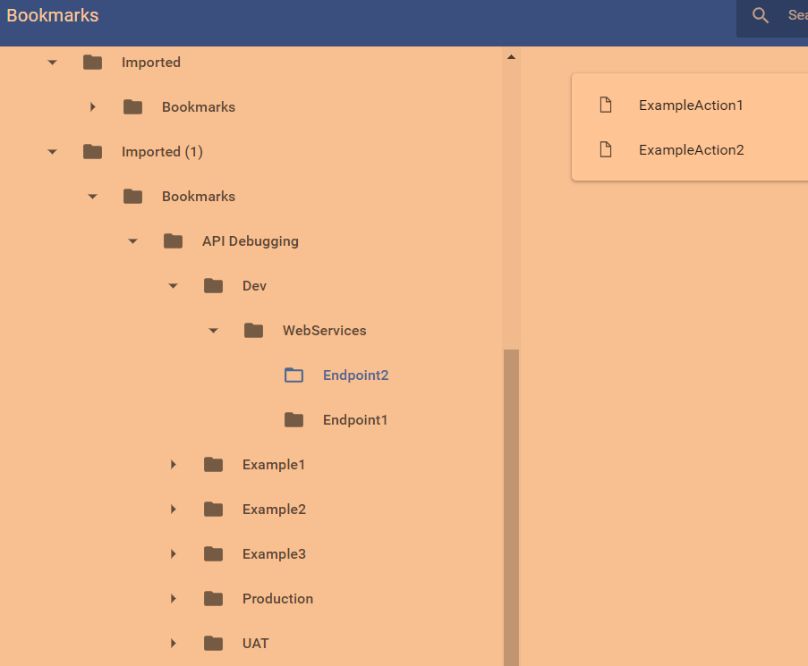

# API Bookmark Generation Tool
A Dynamic Bookmark Generation Tool that will create a Import HTML File containing your commonly used API Endpoints

The problem
-----------

Sometimes we hit the same URL millions of times and instead of opening Postman/Swagger/SoapUI, we'd rather just be able to quickly navigate to it.

Features
--------

- Dynamic Bookmark Creation based on Environment Name for Frontend/WebServices URL
- Ability to add Additional Parameters to end of each call at end of RunMe.ps1 - Line 37 - RunMe.ps1
- Ability to rerun for a different set of environments but change the master folder name that will be represented in the web browser - Line 39 - RunMe.ps1

Usage
--------

1. Edit the Setup Variables and Main Methods in RunMe.ps1 before running to adequately generate the right urls and nested folders. This includes but is not limited to the Endpoints and the potential actions that can be performed on those endpoints. 
2. Open CMD/PS, change to the root directory of the scripts and run RunMe.ps1
3. Bookmark HTML will be generated and ready to import into your browser

Example Picture
--------

